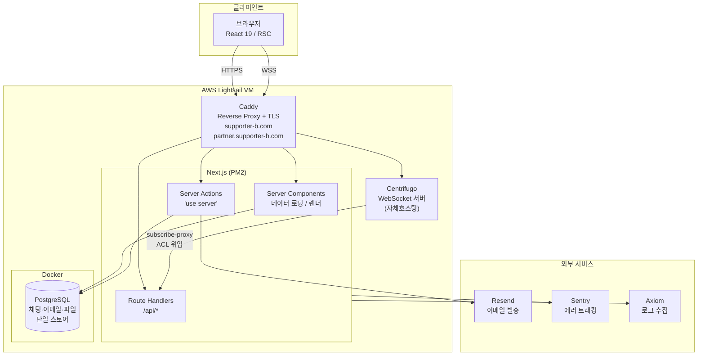
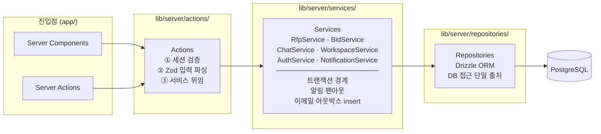
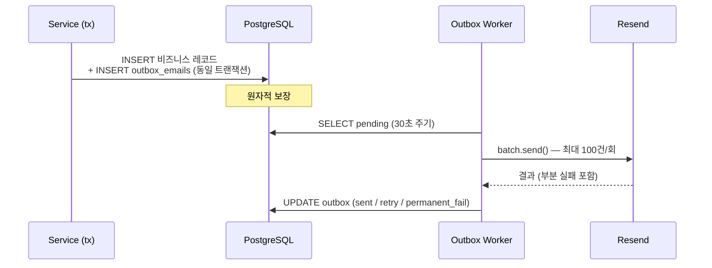

# Supporter B

결제대행사(PG) 견적 입찰 플랫폼. 가맹점(구매사)이 카드 수수료·정산 조건을 담은 견적 요청서(RFP)를 발행하면, 복수의 PG사가 **봉인 입찰(sealed bid)** 로 견적을 제출하고 구매사가 최적 파트너를 선정합니다.

**핵심 도메인 원칙**

- **봉인 입찰** — PG사끼리 서로의 견적·입찰 수·금액을 볼 수 없음 (`Bid.competitorCount` 필드 자체가 없음)
- **참여 = buyer-gated** — 초대(allowlist) 또는 콜드 피치 요청 후 구매사 승인으로만 입찰 가능
- **탐색 = open board** — 마감 전 RFP는 공개 게시판에 노출, 단 구매사명·제목·홈페이지만 공개 (수수료·금액·메모 등 민감 필드는 쿼리 레이어 화이트리스트로 차단)
- **필드 단위 opt-out** — 초대된 PG에게도 '현재 카드 수수료' 노출 여부를 RFP별로 토글 가능, 서버에서 strip

---

## 시스템 아키텍처



채팅 메시지·첨부파일·이메일 아웃박스를 모두 동일한 PostgreSQL에 저장해 외부 오브젝트 스토어나 메시지 브로커 없이 단일 스토어로 운영합니다.

---

## 서버 레이어 아키텍처



의존 방향은 **Actions → Services → Repositories** 단방향. 서비스는 `ServiceResult<T> = { ok: true } & T | { ok: false; error: string }` 형태로 결과를 반환하며 예외를 throw하지 않습니다.

**레이어 경계 강제**: `@typescript-eslint/no-restricted-imports` 규칙으로 `lib/server/repositories/` 외부에서 Drizzle 클라이언트·스키마를 직접 import하면 lint error. 드리프트 가드 테스트(`lib/server/__tests__/repo-boundary.test.ts`)가 CI에서 이중 검증합니다.

---

## 라우팅 구조

```
app/
├─ (public)/          # 비인증: /login, /signup, /invite/[token], /pending-approval
└─ (app)/             # 인증 + AppShell (Sidebar + Header)
   ├─ home/
   ├─ rfp/            # 구매사 — RFP 목록·상세·작성 (/rfp/new)
   ├─ inbox/          # PG사 — 견적 수신함
   ├─ opportunities/  # PG사 — 오픈 RFP 게시판
   ├─ messages/       # 공통 — 실시간 채팅 (Centrifugo)
   └─ settings/
```

**멀티 호스트 라우팅**: 단일 Next.js 앱이 두 도메인을 서빙합니다. `(app)/layout.tsx`가 요청 호스트를 읽어 세션 워크스페이스 타입(buyer/pg)과 일치하지 않으면 올바른 호스트로 리다이렉트합니다. 세션 쿠키는 `.supporter-b.com`으로 스코프해 크로스 서브도메인 SSO를 지원합니다.

---

## 핵심 기술 결정

### 이메일 발송 — Transactional Outbox Pattern

이메일 발송 실패가 비즈니스 로직을 롤백하지 않도록 outbox 테이블을 사용합니다.



Resend의 초당 2요청 한도는 `batch.send()`로 N건을 단일 호출로 묶고, 지수 백오프(최대 3회 재시도)와 idempotency key로 중복 발송을 방지합니다.

### 실시간 채팅 — Centrifugo + Subscribe-Proxy

Centrifugo를 자체호스팅 WebSocket 서버로 운영합니다. 채널 구독 승인을 **subscribe-proxy**로 Next.js API 라우트에 위임해, 봉인 입찰 보안 경계와 채팅 ACL이 동일한 코드베이스 안에서 유지됩니다. 메시지 영속은 자사 PostgreSQL에만 저장하며 Centrifugo는 전달 레이어 역할만 합니다.

### 봉인 입찰 보안

PG사가 견적 브리프를 열 때 RSC 데이터 로더(`lib/server/rfp-detail-loader.ts`)가 서버에서 민감 필드를 제거합니다. 클라이언트 렌더 게이트만으로는 RSC payload에 원본 데이터가 포함되기 때문에 데이터 레이어에서 차단하는 것이 필수입니다.

### Repository Boundary — 아키텍처를 린트로 강제

```
lib/server/repositories/  ← DB 접근 허용
lib/server/services/       ← repository 주입만 허용
lib/server/actions/        ← service 호출만 허용
app/                       ← action / server component만 허용
```

`no-restricted-imports` ESLint 규칙 + 독립 드리프트 가드 테스트로 레이어 경계를 코드 리뷰 없이도 자동 차단합니다. 의도적 예외(storage blob 티어, 크로스 aggregate 캐스케이드 등)는 `lib/server/db-boundary-allowlist.mjs`에 명문화합니다.

---

## 테스트 전략

| 레벨 | 도구 | 전략 |
|------|------|------|
| 단위 | Vitest + **PGlite** | 실제 PostgreSQL DDL을 인메모리로 구동. Mock DB 없이 스키마·쿼리·트랜잭션을 직접 검증 |
| 컴포넌트 | Vitest + jsdom + Testing Library | 클라이언트 컴포넌트 상호작용 테스트 |
| E2E | Playwright | 구매사·PG 두 워크스페이스 전체 시나리오 검증 |

**TDD 원칙**: 구현 코드 작성 전 반드시 실패하는 테스트를 먼저 작성합니다. PGlite 싱글턴 + TRUNCATE로 테스트 간 격리를 유지하며 전체 단위 테스트 3,300+ 케이스가 약 200초 내에 완료됩니다.

---

## 기술 스택

| 레이어 | 기술 | 선택 이유 |
|--------|------|-----------|
| Framework | Next.js 16 App Router | RSC로 서버 fetch 레이어 단순화, Server Actions으로 form 처리 |
| Runtime | React 19 | RSC + Server Actions 풀 지원 |
| ORM | Drizzle ORM | 트랜잭션 핸들을 직접 전달 가능 → Service 레이어 tx 경계 설계 |
| Auth | Auth.js v5 | Edge-safe JWT, Custom credentials provider |
| Realtime | Centrifugo | 자체호스팅 WebSocket, subscribe-proxy로 ACL을 앱에 보존 |
| 이메일 | Resend + Outbox | 발송 실패와 비즈니스 로직을 트랜잭션으로 분리 |
| 테스트 DB | PGlite | 실제 PostgreSQL DDL을 인메모리로 → CI 속도 + 현실적 검증 |
| Styling | Tailwind v4 + CSS Variables | 디자인 시스템 토큰 기반 일관성 유지 |
| 상태 관리 | Zustand | UI 토글·시그업 초안·헤더 액션 슬롯 등 경량 전역 상태 |
| DnD | @dnd-kit | 칸반 보드 드래그·정렬 (`fractional-indexing` 병용) |
| 모니터링 | Sentry + Axiom (Pino) | 에러 트래킹 + 구조화 로그 |
| 배포 | AWS Lightsail + Caddy + PM2 | 단일 VM 자체호스팅, Caddy가 TLS·리버스프록시·WSS 통합 처리 |
